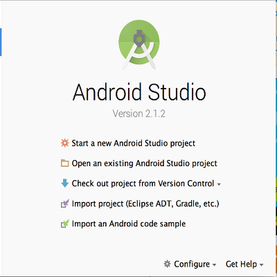
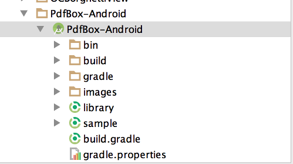
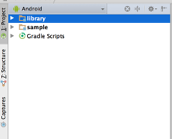

PdfBox-Android
==============

A port of Apache's PdfBox library to be usable on Android. Most features should be implemented by now. If you find any issues or want to request a feature that you need for your project, please use the issue tracker. Stable releases can be added as a Gradle by declaring ``` org.apache:pdfbox-android:1.8.9.0 ``` as a dependency with jcenter set as a repository. The latest releases can be built by cloning the repo and running Gradle. The tasks for building are set as default, so running ```gradlew.bat``` or ```./gradlew``` will take care of all necessary tasks. [The Bintray project is located here.](https://bintray.com/birdbrain2/PdfBox-Android/PdfBox-Android/view)

The main code of this project is licensed under the Apache 2.0 License, found at http://www.apache.org/licenses/LICENSE-2.0.html Code released under other licenses will be stated in the header.

#### Important notes:

-Based on PdfBox v1.8.9

-This is still a work in progress

-Unavailable classes, such as awt, are replaced with their closest Android approximation

#### Libraries:
SpongyCastle core, prov, and pkiv: https://github.com/rtyley/spongycastle/

#### Setting up your development environment:
- Ensure that you have *$ANDROID_HOME* (*%ANDROID_HOME%* for windows) set to a valid location.

- You can get your current SDK version by going to the *$ANDROID_HOME/platforms* directory. Use this information to update the *./gradle.properties* file.

```
VERSION_NAME=1.8.9.1
VERSION_CODE=1

ANDROID_BUILD_MIN_SDK_VERSION=9
ANDROID_BUILD_TARGET_SDK_VERSION=22
ANDROID_BUILD_SDK_VERSION=22
ANDROID_BUILD_TOOLS_VERSION=23.0.1
```

- At the root of the project type in the following command:
```
$ gradle
```

The objective of this exercise is to check if your build tool can build a valid library, after the aforementioned settings were made. If so, you should get a similar result, as listed below

```
:library:generateRelease
Release 1.8.9.1 can be found at /Users/reymalahay/dev/PdfBox-Android/PdfBox-Android/library/build/release/1.8.9.1/
Release 1.8.9.1 zipped can be found /Users/reymalahay/dev/PdfBox-Android/PdfBox-Android/library/build/release-1.8.9.1.zip

BUILD SUCCESSFUL

Total time: 1 mins 12.143 secs
```


##### Android Studio
- From this point onwards, i will assume you are using Android Studio to develop Android apps. If you are still using Eclipse ADT, you should [seriously consider migrating](http://android-developers.blogspot.ca/2015/06/an-update-on-eclipse-android-developer.html).
- Fire up Android Studio. You will then be faced with a dialog similar to the one listed below; select *Import project (Eclipse ADT, Gradle, etc)*




- In the file selector, select the location of where you cloned this project. Please refer to the example below:



- After selecting the project location, and clicking *OK*, give the IDE a chance to index all the files. After indexing is done, the left pane of the IDE should look as illustrated below:




- Your development environment is ready. Code away...

##TODO
- Environment installation guide for the Eclipse diehards (i did not forget where i came from...)
